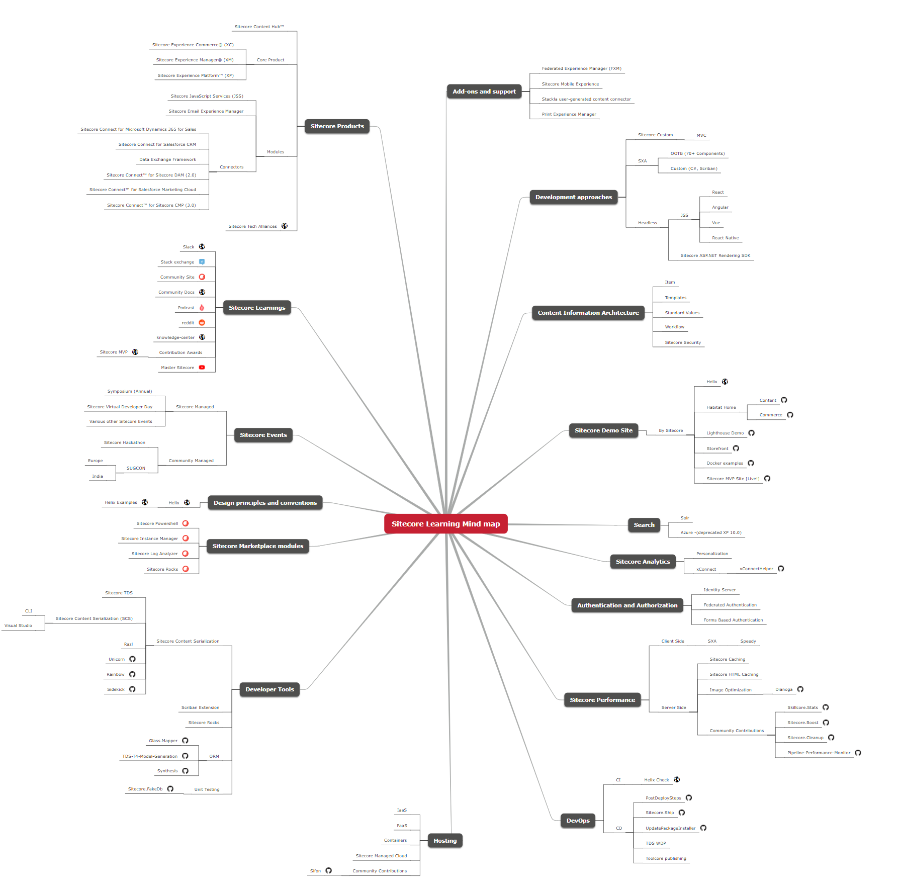

# Sitecore Learning Mind map
The Sitecore learning mind map is a list of topics organized by high-level category.  Which should help newbie/experienced Sitecore enthusiasts to explore sources by category.

You can click here: https://www.mindomo.com/mindmap/4e574017784f416fbaa6775671d19cf8 to open the web version. Which allows you to zoom, scroll and click on links for a few of the topics. (I would like to add the link for all topics someday!)
This list might not have everything as the Sitecore ecosystem has grown a lot! But feel free to create a request in GitHub and I will update it for you!

